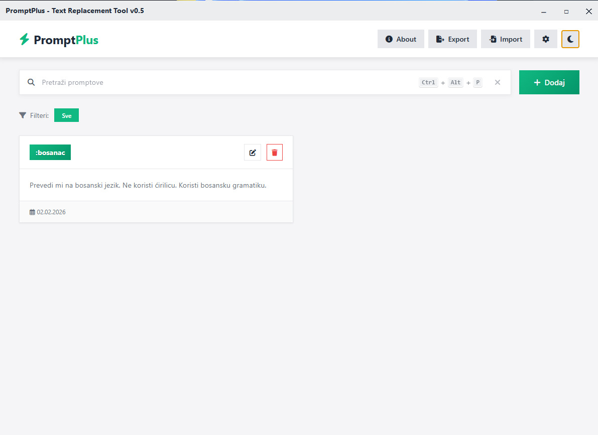

# PromptPlus - Real-time Prompt Replacer

## Description
A tool for managing prompts with keywords that are automatically replaced in real-time as you type in any application.

## Features
- Define prompts with keywords (e.g., :translate, :summarize)
- Automatic keyword replacement as you type in any application
- Manage prompts through a web interface (FastAPI)
- Open Quick Search with `Ctrl+Alt+P` to find and paste a saved prompt
- Compatibility with Gemini AI models
- Ability to set environment variables (API keys)
- Animated loading screen with "Loading..." text and dots when the application starts
- Borderless window design with buttons for minimization, maximization, and closing

## Usage
1. Start the application: `python main.py`
2. The UI will open in a window (backend at `http://127.0.0.1:8080`)
3. Add your prompts with keywords
4. The text replacer automatically runs in the background. Type a keyword followed by Space to replace it.
5. Press `Ctrl+Alt+P` to open Quick Search. The shortcut does not block key events in other apps, so a shortcut collision may still affect the active app.



## Installation
```
uv pip install -r requirements.txt
```

## Running
```
python main.py
```

## Windows executable

Install the requirements and PyInstaller in a virtual environment, then run `python build.py`. The executable is produced at `dist/PromptPlus/PromptPlus.exe` with its supporting files in the same directory.

## Notes
- The application must have permissions for keyboard monitoring and keypress simulation
- During replacement, text clipboard content is saved and restored after replacement when nonempty
- The application saves prompts in `prompts.json` during development and in `%LOCALAPPDATA%/PromptPlus/prompts.json` in the Windows executable. Saves and imports replace this file atomically.
- For the best experience, use keywords that will not appear accidentally in normal text
- The web interface uses FastAPI instead of Streamlit due to compilation issues into EXE
